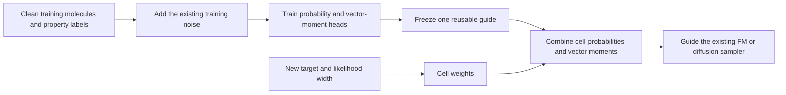

# Innovation v8 — Training a reusable, guidance-aware posterior representation

**18 September 2026 · research proposal, not an adopted replacement for S + D + SMG.**

Companion: [training-time feasibility gates](../../archive/TRAINING_GUIDANCE_FEASIBILITY.md).
Previous method: [SMG mathematics](SMG_FULL_MATH_AND_PROOFS.md).

Status convention: `[PROVED]` derivation under explicit assumptions; `[CHECKED]` executed
numerical check; `[TAKEN]` established idea; `[DESIGN]` proposed implementation;
`[HYPOTHESIS]` requires an experiment; `[UNRESOLVED]` research priority not established.

## 1. Recommendation and the actual innovation claim

**Investigate two connected ideas: (A) a coherent posterior guidance operator and (B)
guidance-aware partition learning. B is the stronger research hypothesis; A supplies its
representation and a useful independent efficiency experiment.**

In plain language: train a small model to represent both **which property outcomes remain
possible** and **which direction moves probability toward each outcome**. New target bands
or likelihoods then become inexpensive combinations of these outputs. Allocate extra
training resolution to property regions that cause the largest guidance errors, including
rare regions that an ordinary probability-prediction objective might underemphasize.

This moves work from repeated inference-time differentiation into auxiliary training.
It does not require retraining the generator first. An auxiliary guide is a training-time
intervention; it is not a claim that guidance has disappeared or that the original generator
weights have changed. A later joint-training version is optional and a separate experiment.

The new project IDs are **CPGO** and **GAPL**. A/B below are local exposition labels, not
replacements for the existing A/B method components. The new feasibility gates use TG-0–TG-4
to distinguish them from TRE's T-0–T-2.

| Idea | Proposed change | Main falsifiable advantage | Novelty assessment |
|---|---|---|---|
| **A. Coherent posterior guidance operator (CPGO)** | Learn probability and centered endpoint-vector mass for shared property cells; enforce their algebraic identities | Reuse one trained guide for new targets, with no guide backward pass at inference | Specific formulation is a candidate; conditional expectation operators, classifier guidance, and learned guidance are established |
| **B. Guidance-aware partition learning (GAPL)** | Choose the cells using an error bound involving endpoint residuals and target likelihood variation | Lower guidance error at the same number of cells, parameters, and training budget | Stronger candidate contribution; adaptive discretization itself is established |

**No honest proof establishes that an idea is absent from all current academic work.**
The proofs below establish mathematical properties, not priority. A targeted primary-source
search through 18 September 2026 did not identify this complete A+B construction, but that
is not a novelty certificate. The strongest defensible claim is a specific hypothesis about
how to train and compress reusable guidance. Merely learning posterior moments, adding a
classifier, distilling SMG, or training a residual head would be insufficient novelty.

## 2. Why moving guidance into training could help our current project

SMG approximates a nonlinear property's posterior distribution using a corrected mean and a
variance. It incurs denoiser/property derivatives during generation and uses a truncated
surrogate-likelihood gradient. Our new question is: **can training recover information about
the full relevant property distribution and its guidance directions more economically?**

### 2.1 Two moments can be fundamentally insufficient `[PROVED]` `[CHECKED]`

Consider two property distributions:

\[
P_A(Y=-1)=P_A(Y=1)=1/2,
\]
\[
P_B(Y=-\sqrt3)=P_B(Y=\sqrt3)=1/6,\qquad P_B(Y=0)=2/3.
\]

Both have mean zero and variance one. Yet
\(P_A(|Y|<1/2)=0\) and \(P_B(|Y|<1/2)=2/3\).
Thus a method retaining only these two moments cannot recover every target-band probability.
Adding two to Y makes this example nonnegative without changing the argument.

This proves an information limitation, **not that SMG necessarily fails on QM9**. It also
does not prove a different guidance gradient at a particular state: gradients require the
state-dependent posterior, which the next sections represent explicitly.

### 2.2 Accurate probability values do not guarantee useful gradients `[PROVED]`

For \(h(x)=1/2\) and \(\hat h(x)=1/2+10^{-4}\sin(10^4x)\), the maximum value error is
\(10^{-4}\), but \(\hat h'(0)-h'(0)=1\). Both functions stay positive.
Probability calibration and guidance-vector accuracy therefore need separate tests.
This motivates learning vector moments directly, but does not establish that doing so will
beat a well-trained noisy classifier.

## 3. Shared setup: fix the target law before discussing guidance

Let Z denote the clean continuous molecular state, with atom count and padding mask fixed.
Coordinates live in the zero-center-of-mass subspace; atom features remain continuous during
sampling. Use orthonormal coordinates on that feasible subspace for the following identities.

\[
X_t=\alpha_t Z+\sigma_t\epsilon,\qquad \epsilon\sim N(0,I),\quad \epsilon\perp Z.
\]

Here \(\alpha_t>0,\sigma_t>0\) in the interior. Independent Gaussian FM has
\(\alpha_t=t,\sigma_t=1-t\). VP diffusion uses the existing schedule and its reverse-time
convention. These formulas do not automatically apply to OT couplings or Dirichlet paths.

Write \(Y=f_A(Z)\) for the primary mechanistic experiment. Using the same f_A on clean data
for every arm keeps the guidance target identical. A secondary experiment can use measured
QM9 labels, provided **all trainable comparator arms receive those same labels**. Neither
experiment uses f_B for training. Changing from f_A labels to measured labels is a change of
target and supervision, not evidence for the proposed architecture alone.

For a nonnegative bounded weight \(w(Y)\), define

\[
q_w(z)=\frac{p(z)w(f_A(z))}{E_p[w(Y)]},\quad
h_w(x,t)=E[w(Y)\mid X_t=x],\quad m(x,t)=E[Z\mid X_t=x].
\]

A Gaussian likelihood and a hard interval indicator are different w's. A tolerance used for
reporting success does not specify the training likelihood. Require \(E_p w>0\).

### Proposition 1 — exact guidance as a vector-valued conditional moment `[TAKEN]` `[PROVED]`

Under integrability and differentiation-under-the-integral assumptions,

\[
\nabla_x h_w=\kappa_t E[(Z-m)w(Y)\mid x],\qquad
\boxed{G_w=\nabla_x\log h_w
=\kappa_t\frac{E[(Z-m)w(Y)\mid x]}{E[w(Y)\mid x]}},\qquad
\kappa_t=\frac{\alpha_t}{\sigma_t^2}.
\]

**Proof.** Differentiating the Gaussian posterior gives
\(\nabla_x\log p(z\mid x)=\alpha_t(z-m)/\sigma_t^2\).
Multiply by w and integrate. Divide by h_w when h_w is positive. No differentiability of
w or f_A is needed in this argument; the Gaussian corruption smooths the conditioning
probability in the interior. □

This identity belongs to the established guidance/conditional-expectation framework; see
[On the Guidance of Flow Matching](https://arxiv.org/html/2502.02150v3).

**Sampler conversion.** For independent linear FM the exact velocity addition is
\(u_w=(1-t)G_w/t\). For our VP probability-flow ODE, with diffusion time running downward,
add \(-\beta(\tau)G_w/2\) to the derivative in that time coordinate. Preserve the existing
signed step. The reverse SDE uses a different coefficient. Do not treat G as a velocity.

Exact target sampling also requires the exact base field, the correct initial marginal,
appropriate endpoint limits, and exact integration. Our finite VP terminal noise and FM
guidance switch introduce approximation. Training from real data targets the data-corruption
posterior; adding that guide to an imperfect generator does **not** exactly tilt the learned
generator's output law. Keep these model errors separate from guide errors.

## 4. Idea A — Coherent posterior guidance operator

### Step A1 — replace two property moments with a small shared partition `[DESIGN]`

Partition the property axis into exhaustive, disjoint cells \(B_1,\ldots,B_K\), including
underflow and overflow cells. Start with K=16; compare K=8 and K=32 only if the pilot works.
Let \(I_j=1\{Y\in B_j\}\). Define

\[
p_j=E[I_j\mid x],\qquad c_j=E[(Z-m)I_j\mid x].
\]

For any query constant on these cells, \(w(Y)=a_j\) on \(B_j\),

\[
\boxed{h_a=\sum_j a_jp_j,\qquad G_a=\kappa_t\frac{\sum_j a_jc_j}{\sum_j a_jp_j}.}
\]

The trainable model does not receive y* or s. They enter the coefficients a after training.
This supports unseen query values **for this property and represented cells**, not arbitrary
new properties. Smooth likelihoods incur quantization error; arbitrary band edges cutting
through cells are approximate. Aligning only test-query boundaries after observing test
results would leak information and is forbidden.

### Step A2 — train from ordinary noisy-clean pairs, without posterior sampling `[DESIGN]`

Freeze the current generator, which provides an approximate endpoint mean \(\bar m(x,t)\).
Train an invariant probability head \(\hat p=\mathrm{softmax}(\ell_\phi)\), and K equivariant
vector heads \(\hat d_j\), using

\[
L_p=E[-\log\hat p_{b(Y)}(X_t,t)],
\]
\[
L_d=E\left[\sum_j\|\hat d_j(X_t,t)-I_j(Z-\bar m(X_t,t))\|^2\right].
\]

The clean Z and noise are already available in the FM/diffusion training pipeline. Detach
the generator/anchor; no Hessian label, derivative teacher, or trajectory rollout is needed.
MSE learns conditional expectations, not the individual stochastic labels. Time weights
strictly positive on the declared training interval preserve the pointwise population
optimum; label-dependent oversampling requires importance weights to preserve it.

Use the same valid-state norm convention across arms. Fixed coordinate/feature scaling is
allowed, but per-sample clipping of vector targets changes the estimand and must be disclosed.

### Step A3 — remove the imperfect anchor coherently `[DESIGN]` `[PROVED]`

At inference compute

\[
\hat D=\sum_j\hat d_j,\qquad
\boxed{\hat c_j=\hat d_j-\hat p_j\hat D.}
\]

**Proposition 2.** With exact conditional regression and class probabilities, this yields
c_j even when the frozen generator's endpoint mean is wrong.

**Proof.** The population regression target is
\(d_j=E[ZI_j\mid x]-\bar m p_j\). Thus
\(D=\sum_jd_j=m-\bar m\), and
\(d_j-p_jD=E[ZI_j\mid x]-mp_j=c_j\). □

This is an algebraic cancellation of the anchor, not a correction of the base generator's
sampling law. It does not eliminate finite-sample regression error. A poor anchor may
increase label variance and make learning harder. Its value is that a fixed imperfect
checkpoint need not impose a permanent bias in the guidance statistic.

### Proposition 3 — identities hold even before perfect learning `[PROVED]`

Because \(\sum_j\hat p_j=1\) and \(\sum_j\hat c_j=0\):

1. A constant likelihood gives zero guidance exactly, up to roundoff.
2. Disjoint-event likelihoods add in probability and vector mass. For events A and B,
   \(G_{A\cup B}=(h_AG_A+h_BG_B)/(h_A+h_B)\), when their probabilities are positive.
3. Merging cells by summing p and c leaves every query constant on the merged cells unchanged.
4. A monotone relabeling of the property leaves outputs unchanged **if the same physical
   cells and weights are transported exactly**, without retraining or rebuilding equal-width
   bins. Decreasing transformations reverse interval order and require consistent endpoints.

These follow directly by summing the displayed formulas. They are algebraic guarantees,
not guarantees of calibrated probabilities, chemical validity, correct scores, or diversity.
In particular, the learned c need not satisfy \(\kappa_t\hat c_j=\nabla_x\hat p_j\).
Measure this derivative consistency; optional training regularization has a training cost.
A standard classifier differentiated through a shared softmax also satisfies several of
these identities. **Coherence by itself is not our novelty claim.**

### Proposition 4 — finite estimation error remains visible `[PROVED]`

Let \(e_j=\hat d_j-d_j\), \(r_j=\hat p_j-p_j\),
\(\epsilon_d=\sum_j\|e_j\|\), \(\epsilon_p=\sum_j|r_j|\), and
\(b=\|m-\bar m\|\). For coefficients \(0\le a_j\le1\),

\[
\left\|\sum_j a_j(\hat c_j-c_j)\right\|
\le 2\epsilon_d+\epsilon_p(b+\epsilon_d),\qquad
|\hat h_a-h_a|\le\epsilon_p.
\]

**Proof.** Set \(E=\sum e_j\), \(D=m-\bar m\). Subtraction gives
\(\hat c_j-c_j=e_j-p_jE-r_j(D+E)\).
Apply the triangle inequality, \(\|E\|\le\epsilon_d\), and \(\sum a_jp_j\le1\). □

Hence rare queries with small h can amplify estimation errors. A denominator floor is a
stability intervention with bias, not an exact conditional sampler. Log how often it fires.

### Step A4 — small implementation, explicit costs `[DESIGN]`

Start with an independent small EGNN guide or a frozen-backbone probe with equivariant
coordinate heads, continuous-feature heads, invariant logits, and time/log-SNR input.
Compare the two architecture choices only after the first pilot. Sharing frozen features
may save work but can limit representational capacity; a scalar linear readout cannot
magically produce all equivariant vector directions.

At each solver stage: evaluate the base model, evaluate the guide, center d, contract with a,
and convert G to the family's vector field. Count both forwards, all K outputs, memory, and
solver stages. No inference-time guide backward pass is required. K vector heads can still
be expensive; speed is a measurement, not a consequence of the formula.

**What would distinguish A experimentally?** Retain the quality of a query-conditioned
learned guide on held-out target/width combinations while reducing total cost across a
declared workload of queries. Losing to the same classifier's differentiated probabilities
would refute the usefulness of the vector heads under this budget.

## 5. Idea B — Guidance-aware partition learning

### Step B1 — identify the missing quantity in ordinary bin selection

Uniform bins resolve the property axis. Quantile bins resolve probability mass. Guidance
also depends on **where the clean endpoints lie relative to the posterior mean**.

For a conditional distribution placing 99% at Z=0 and 1% at Z=100, m=1. The two cells each
carry residual mass \(p_j|Z_j-m|=0.99\). The rare cell has 1% of the probability but half of
the absolute centered-vector mass. `[PROVED]` `[CHECKED]`

A rare cell need not matter for every query: likelihood variation and vector cancellation
matter too. The example establishes why probability mass alone cannot bound guidance error.

### Step B2 — derive an error bound for the object we actually use

Let w_K be a cellwise approximation of w. At a fixed state/time, write

\[
h=E[w\mid x],\quad h_K=E[w_K\mid x],\quad
n=E[(Z-m)w\mid x],\quad n_K=E[(Z-m)w_K\mid x].
\]

Define

\[
\eta_0=E[|w-w_K|\mid x],\qquad
\eta_1=E[\|Z-m\||w-w_K|\mid x].
\]

### Proposition 5 — probability error and vector-mass error both matter `[PROVED]`

If h and h_K are at least \(\zeta>0\), then

\[
\boxed{\|G_w-G_{w_K}\|\le
\kappa_t\left(\frac{\eta_1}{\zeta}
+\frac{\|n_K\|\eta_0}{\zeta^2}\right).}
\]

**Proof.** Triangle inequalities give \(|h-h_K|\le\eta_0\) and
\(\|n-n_K\|\le\eta_1\). Now
\(n/h-n_K/h_K=(n-n_K)/h+n_K(h_K-h)/(hh_K)\), and apply the lower bounds. □

The bound addresses quantization with exact moments. Add Proposition 4's learning errors
using the same ratio inequality for a learned guide. Estimated empirical upper bounds are
not automatically valid pointwise confidence bounds on new guided states.

If \(|w(y)-w_K(y)|\le e_j\) in cell j, then
\(\eta_0\le\sum p_je_j\),
\(\eta_1\le\sum b_je_j\), where
\(b_j=E[\|Z-m\|I_j\mid x]\). Smooth likelihoods permit e_j from a Lipschitz constant and
cell width. Hard indicators have e_j=0 in interior/exterior cells and at most 1 in cells
cut by the boundary. Do not apply a smooth bound to the discontinuity.

For a trainable upper-bound surrogate, define
\(\bar b_j=E[\|Z-\bar m\|I_j\mid x]\).
The triangle inequality gives \(b_j\le\bar b_j+p_j\|D\|\), with D from Step A3.
These population quantities can be regressed from the same noised training examples.
Their estimation uncertainty must be assessed before using them as certificates.

### Step B3 — learn the partition for a declared family of future queries `[DESIGN]`

1. Declare a workload distribution over target centers, likelihood widths, atom counts,
   and interior noise levels using training/validation data. Reserve unseen query
   combinations for evaluation. Use the same workload for all competitors.
2. Fit a coarse pilot, for example K=8. Estimate probability mass, endpoint residual mass,
   and scalar-versus-vector guidance discrepancy on an independent calibration subset.
3. Score candidate cell splits by their estimated reduction in the Proposition 5 bound,
   averaged over the declared workload. Include the sampler coefficient so FM/VP training
   weights reflect the actual velocity error. Do not score only probability entropy.
4. Greedily split within a fixed budget, for example to K=16, maintaining minimum label
   support and exhaustive tail coverage. Freeze the resulting partition before final fit.
5. Train a fresh final guide. Compare uniform, quantile, likelihood-error-only, random,
   and guidance-aware partitions with the same final K and total optimization budget.
   Charge pilot, split search, and final fit to GAPL's compute.

The practical split score is a heuristic informed by a proved bound. Finite training,
vector cancellation, rare-target normalization, and imperfect b estimates can make it
fail. Neither greedy optimality nor monotone improvement after each split is claimed.

**Research hypothesis:** preserving guidance-relevant vector mass, rather than only property
probability, gives better conditional generation at a fixed training/inference budget.
This is the main experiment that could elevate A+B above routine learned guidance.

## 6. A tempting third idea that we should reject as a novelty claim

Let U be the conditional path velocity, v=E[U|x], h=E[w|x], and use fitted v-bar/h-bar.
One could train a residual g using the estimating equation

\[
E\{wg-(w-\bar h)(U-\bar v)\mid x\}=0.
\]

Its centered target has the identity
\(E[(w-\bar h)(U-\bar v)|x]=\operatorname{Cov}(U,w|x)
+(v-\bar v)(h-\bar h)\).
This looks attractive because nuisance errors multiply. But samplewise,

\[
wg-(w-\bar h)(U-\bar v)
=\bar h g+(w-\bar h)(\bar v+g-U).
\]

This is the control-variate estimating equation in
[Tilt Matching, equation (24)](https://arxiv.org/html/2512.21829v1#S3.SS2), with control
variate \(c=\bar h\). `[TAKEN]` `[CHECKED]`
Changing its name to “orthogonal guidance” would not create a new algorithm. Keep it as a
strong comparator. The identity also does not make the entire sampler doubly robust to
base-model misspecification.

## 7. Prior-work audit and the narrow claim that survives

Primary sources consulted, retrieved 18 September 2026. “Different” below means a proposed
implementation distinction, not an established first-in-literature finding.

| Primary source | What it already covers | Consequence for our claims |
|---|---|---|
| [On the Guidance of Flow Matching, 2025, §3.5 and Appendix A.7](https://arxiv.org/html/2502.02150v3) | Exact guidance framework and several learned-guidance losses | Learning guidance/covariance or a normalizer is not new. Compare to a query-conditioned GM/RGM implementation |
| [Tilt Matching, December 2025, §3.2](https://arxiv.org/html/2512.21829v1) | Derivative-free reward adaptation with control variates | Residual centering is occupied; include an applicable c-ITM control |
| [Reward Score Matching, April 2026](https://arxiv.org/abs/2604.17415) | Unifying reward fine-tuning through value-guidance estimation | “A new training loss for guidance” is too broad a claim; abstract-level scope checked here |
| [Supervised Guidance Training, January 2026](https://arxiv.org/abs/2601.20756) | Simulation-free learning of guidance in an infinite-dimensional setting | Simulation-free guide training and Doob-transform motivation are not new; abstract-level scope checked here |
| [Conditional mean embeddings as regressors, ICML 2012](https://icml.cc/Conferences/2012/papers/898.pdf) | Learning conditional expectation operators from examples | A reusable expectation operator/basis is established mathematics |
| [Compositional Sculpting, 2023](https://arxiv.org/abs/2309.16115) | Classifier-guided composition of generative distributions | Composition and model reuse are not standalone novelty |
| [Distributional Successor Features, 2024](https://arxiv.org/abs/2403.06328) | Distributional representations that transfer to new reward functions | Reward reuse has broader precedent; this is adjacent RL work |
| [Discrete Guidance Matching, ICLR 2026](https://proceedings.iclr.cc/paper_files/paper/2026/hash/f0470962fc538827f3130757fb707b71-Abstract-Conference.html) | Trained exact discrete guidance with efficient inference | A DNA transfer cannot claim first learned discrete guidance |
| [How to Guide Your Language Flow, 16 September 2026](https://arxiv.org/abs/2609.19356) | Guidance using probes of frozen internal features | “A cheap frozen-backbone probe” is also occupied; abstract-level scope checked here |

**Provisional paper claim:** We investigate a finite property-partition representation of
guidance that predicts both posterior probability and centered endpoint-vector mass. We
allocate partition resolution using a guidance-error bound and test whether this improves
reuse across target queries and useful molecular yield under a fixed total compute budget.

**Novelty gate:** before using “novel method” in the paper, compare the implemented objective,
parameterization, and split criterion against source equations and released implementations
of the closest approaches. If an existing method already implements all three, reframe as a
replication/application. A+B being absent from the papers inspected here is only provisional
evidence. B's causal ablation is necessary; a new acronym or application is insufficient.

Search families included learned/gradient-free guidance, guidance matching, control variates,
conditional covariance, distributional/CDF guidance, posterior partitions, adaptive binning,
conditional mean embeddings, and successor-feature reward reuse. Search engines are incomplete;
no claim is made that all preprints or conference submissions were examined.

## 8. What has actually been checked

Executed [audit/training_guidance_checks.py](../../audit/training_guidance_checks.py), using only
the Python standard library on CPU. Results: [training_guidance_results.json](../../audit/training_guidance_results.json).

| Check over 100 finite-support posterior cases | Maximum discrepancy |
|---|---:|
| Posterior covariance score versus central differences | 3.93 × 10^-10 |
| Partition query versus direct likelihood-weighted posterior | 2.06 × 10^-15 |
| Cancellation of a deliberately wrong endpoint anchor | 5.28 × 10^-16 |
| Disjoint-union identity | 1.59 × 10^-16 |
| Constant likelihood gives zero guidance | 1.91 × 10^-15 |
| Rotation of vector moments and guidance | 0 |
| Violation of quantization error bound | 0 |
| Weighted regression excess-risk identity | 4.45 × 10^-15 |
| Proposed centered equation versus existing c-ITM equation | 9.94 × 10^-16 |

The counterexamples in §§2 and 5 are also checked. These are numerical checks of identities
and limitations. They are **not** neural training, a sampler comparison, molecular results,
runtime measurements, or evidence that B beats equal-sized quantile bins. No local GPU was
used. The molecular feasibility status remains **untested**.

## 9. How this extends the previous plan

Reuse S0 assets, S1 symmetry/derivative checks, S2 evaluation, M-1 noisy-clean pairs,
M-2 matched guidance comparisons, M-3 matched target references, and M-4 solver controls.
Add a training-label learnability gate, a new-query generalization test, and total-cost
amortization. Keep D disabled during the first comparison; adding a diversity controller
would obscure whether the trained guidance itself helps.

M-1's signed curvature gap is useful motivation but is **not a necessary gate** for A+B:
posterior shape or derivative cost can matter even when the mean correction is tiny. Conversely,
a large M-1 gap is not proof that an auxiliary guide can learn the required directions.

For DNA, first use a Gaussian interpolation of centered one-hot features so the same
derivation applies on the feasible linear subspace. Mutually exclusive cell labels can
represent a declared joint category; overlapping classes are not a partition. A native
Dirichlet/simplex process needs its own conditional-path derivation and cannot inherit the
Gaussian score coefficient. Full transfer is a later gate, not evidence already obtained.

**Decision:** fund the cheap algebra + learned-toy + one-checkpoint pilot first. Advance one
combined A+B method only if its own mechanisms and the independently evaluated useful-output
gates pass. The existing project remains the fallback until then.
